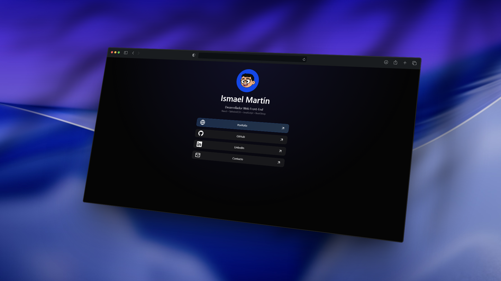

# 🔗 LinkHub

Minimal, elegant and personal link hub designed to centralize and showcase my online presence.

---

## ✨ Preview



---

## 🚀 About the project

LinkHub is a personal project built to organize and present my most relevant links in a clean, modern and accessible way.

Its main purpose is to act as a **central hub for my online presence**, allowing quick access to my portfolio, projects and contact channels.

---

## 🧠 Purpose

Instead of relying on third-party link-in-bio tools, this project gives me:

- full control over design and user experience.
- independence from external platforms.
- the ability to evolve it as my personal brand grows.

---

## ⚙️ Features

- ⚡ Fast and lightweight
- 🎨 Clean UI built with TailwindCSS
- 📱 Fully responsive design
- 🌙 Dark mode support
- 🔗 Structured and customizable links

---

## 🧩 Tech Stack

- React
- TailwindCSS
- Vite

---

## 📦 Installation

```bash
git clone https://github.com/tuusuario/linkhub
cd linkhub
pnpm install
pnpm dev
```

---

## 🛠️ Customization

This project is intentionally simple and flexible.

You can:

- update links easily from the code.
- customize styles using TailwindCSS.
- adapt the layout to your personal needs.

---

## 🌍 Deployment

Recommended platforms:

- Vercel
- Cloudflare Pages

---

## 👤 Author

- Portfolio: https://ismartin.com

---

## 📌 Notes

This project represents a practical approach to personal branding, combining simplicity, performance and full control over my own digital presence.
